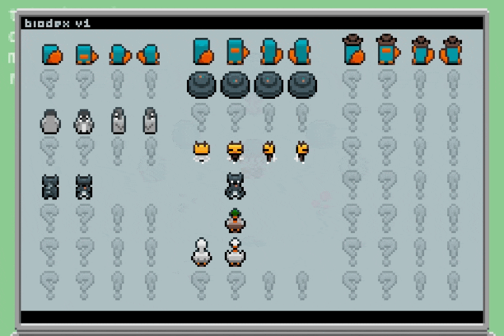

# Animals

Nostalgic GBA inspired game about catching animals and making them battle

<div>
  
  
</div>


## Getting Started


```bash
bun index.html
```

## Pixel Art and Level Design

If you want to work on pixel art or level design, you need:

- [Aseprite](https://www.aseprite.org/) (for pixel art) *$15-20*\*
- [Tiled](https://www.mapeditor.org/) (for level design) *FREE*

> [!TIP]
> \*You can [compile Aseprite from source](https://github.com/aseprite/aseprite/blob/main/INSTALL.md#platforms), if you don't want to buy it, or try [LibreSprite](https://libresprite.github.io/) as a free alternative
>
> Just make sure you're not breaking Aseprite support

## Features

- Dance battle system
- Catching animals
- Fun movement system
  - Walk, run, jump, roll, 
  - Parkour
  - Skateboarding with tricks
- Electric guitar (Zelda inspired, but real-time)
- Dialog system using [Rapid Serial Visual Presentation (RSVP)](https://www.youtube.com/watch?v=5yddeRrd0hA), not text boxes
  - Voices/noises are synthesized (only vowels from words?)
